# Numpy学习笔记 （基于Numpy 1.11.0）

- `ndarray`：`NumPy`最重要的对象就是`ndarray`（也可以称它为`array`），它是一个多维的容器。其存放元素通常是相同的类型和大小的。
- `axes`：`Numpy`的维度称之为`axes`
- `rank`：维度数量称之为`rank`

比如`ndarray:[[1,0,0],[0,1,2]]`的`rank`为2，第一维的长度为2（行），第二维的长度为3（列）.
>- `numpy.ndarray`与`Standard Python Library`的`array.array`不同，二者并不是同一个类
>- `ndarray`的维度可以为0，此时为标量；若维度为1维则为向量；若维度为2维则为矩阵....

## 一、 ndarray

`ndarray`比较重要的属性有：

- `ndarray.ndim`：`ndarray`的`rank`，即有几个维度
- `ndarray.shape`：`dimensions of the array`。它是`N`个正整数组成的元组，用于指示容器每一个维度的大小。对于一个`n`行`m`列的矩阵，`.shape`为`(n,m)`。因此`.shape`的`length`等于`ndarray.ndim`
- `ndarray.size`：`ndarray`中`elements`的总数量。它等于`.shape`中各分量的乘积
- `ndarray.dtype`：一个`object`用于描述`array`中`elements`的`type`。
	>你可以创建标准的`Python type`，也可以用`Numpy`提供的`type`，如`numpy.int32`、`numpy.float64`等
- `ndarray.itemsize`：`array`中每个`element`的字节大小。它也等于`ndarray.dtype.itemsize`
- `ndarray.data`：存放真正数据的`buffer`。通常我们不会使用这个属性，因为我们从不通过这个属性来访问数据。
	> 通常都是用索引来访问数据
- `ndarray.real`：返回`ndarray`的实部
- `ndarrray.imag`：返回`ndarray`的虚部
- `ndarray.flat`：返回`ndarray`上的一个一维的`iterator`
- `ndarray.T`：返回`ndarray`的转置。如果`ndarray`维度小于1，则返回它本身

> 如果每一行的列数不是完全相同，那么`.shape`属性只会显示`(rows,)`这种格式。

  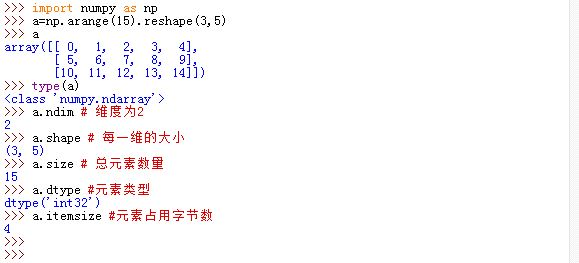 

### 1. 创建 ndarray 

创建`ndarray`对象有很多方法：

#### a. 创建全1或者全0

- `empty(shape[,type,order])`：返回一个新的`ndarray`，指定了`shape`和`type`，但是没有初始化元素。
  因此其内容是随机的。
- `empty_like(a[,type,order,subok])`：返回一个新的`ndarray`，
  `shape`与`a`相同，但是没有初始化元素。因此其内容是随机的。

  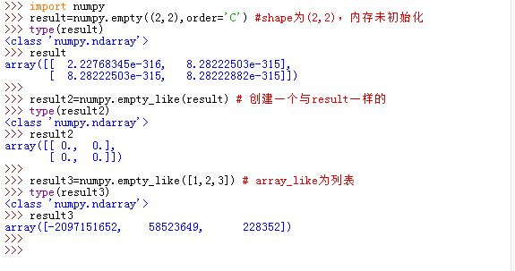 

- `eye(N[, M, k, dtype])`：返回一个二维矩阵，对角线元素为1，其余元素为0。`M`默认等于`N`。`k`默认为0表示对角线元素为1，如为正数则表示对角线上方一格的元素为1，如为负数表示对角线下方一格的元素为1.
- `identity(n[, dtype])` ：返回一个单位矩阵

   

- `ones(shape[, dtype, order])`：返回一个新的`ndarray`，指定了`shape`和`type`，每个元素初始化为1.	- `ones_like(a[, dtype, order, subok])` ：返回一个新的`ndarray`，
  `shape`与`a`相同，每个元素初始化为1。

   

- `zeros(shape[, dtype, order])` ：返回一个新的`ndarray`，指定了`shape`和`type`，每个元素初始化为0.
- `zeros_like(a[, dtype, order, subok])`：返回一个新的`ndarray`，
  `shape`与`a`相同，每个元素初始化为0。

  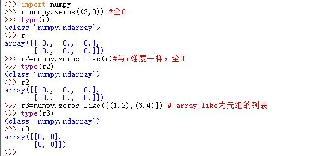

- `full(shape, fill_value[, dtype, order])`：返回一个新的`ndarray`，指定了`shape`和`type`，
  每个元素初始化为`fill_value`。
- `full_like(a, fill_value[, dtype, order, subok])`：返回一个新的`ndarray`，
  `shape`与`a`相同，每个元素初始化为`fill_value`。

 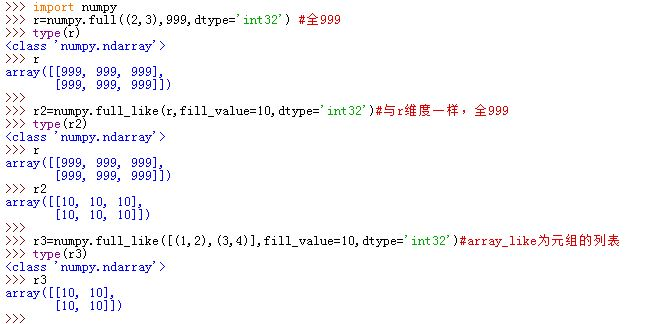

这里有几个共同的参数：

- `a`：一个`array-like`类型的实例，它不一定是`ndarray`，可以为`list`、`tuple`、`list of tuple`、`list of list`、`tuple of list`、`tuple of tuple`等等。
- `dtype`：结果的元素的类型，默认为`float`。你可以指定`Python`的标准数值类型，也可以使用`numpy`的数值类型如：`numpy.int32`或者`numpy.float64`等等。
- `order`：指定存储多维数据的方式。可以为`'C'`，表示按行优先存储（C风格）；可以为`'F'`，表示按列优先存储（Fortran风格）
	> 对于`**_like()`函数，`order`可以为:`'C'`，`'F'`，`'A'`（表示结果的`order`与`a`相同），`'K'`（表示结果的`order`与`a`尽可能）
- `subok`：`bool`值，如果为`True`则如果`a`为`ndarray`的子类（如`matrix`类），则结果类型与`ndarray`类型相同。如果为`False`则结果类型始终为`ndarray`。默认为`True`。

#### b. 从现有数据创建

- `array(object[, dtype, copy, order, subok, ndmin])`:从`object`创建。
	- `object`可以是一个`ndarray`，也可以是一个`array_like`的对象，
	  也可以是一个含有返回一个序列或者`ndarray`的`__array__`方法的对象，或者一个序列。
	- `copy`：默认为`True`，表示拷贝对象
	- `order`可以为`'C'、'F'、'A'`。默认为`'A'`。
	- `subok`默认为`False`
	- `ndmin`：指定结果`ndarray`最少有多少个维度。
- `asarray(a[, dtype, order])`：将`a`转换成一个`ndarray`。其中`a`是`array_like`的对象，
  可以是`list`、`list of tuple`、`tuple`、`tuple of list`、`ndarray`类型。`order`默认为`C`。
- `asanyarray(a[, dtype, order])`:将`a`转换成`ndarray`。
- `ascontiguousarray(a[, dtype])` ：返回C风格的连续`ndarray`
- `asmatrix(data[, dtype]) `：返回`matrix`
- `copy(a[, order])`:返回`ndarray`，从输入中拷贝元素
- `frombuffer(buffer[, dtype, count, offset])`：从输入数据中返回一维`ndarray`。`count`指定读取的数量，`-1`表示全部读取；`offset`指定从哪里开始读取，默认为0
- `fromfile(file[, dtype, count, sep])` :从二进制文件或者文本文件中读取数据返回`ndarray`.`sep`：当从文本文件中读取时，数值之间的分隔字符串，如果`sep`是空字符串则表示文件应该作为二进制文件读取；如果`sep`为`" "`表示可以匹配0个或者多个空白字符。
- `fromfunction(function, shape, **kwargs)`:返回一个`ndarray`。从函数中获取每一个坐标点的数据。假设`shape`的`rank`为N，那么`function`带有`N`个参数，`fn(x1,x2,...x_N)`，其返回值就是该坐标点的值。
- `fromiter(iterable, dtype[, count])`：从可迭代对象中迭代获取数据创建一维`ndarray`。
- `fromstring(string[, dtype, count, sep]) `：从字符串或者`raw binary`中创建一维`ndarray`。如果`sep`为空字符串则`string`将按照二进制数据解释（即每个字符作为`ASCII`码值对待）。
- `loadtxt(fname[, dtype, comments, delimiter, ...])`:从文本文件中加载数据创建`ndarray`，要求文本文件每一行都有相同数量的数值。`comments`：指示注释行的起始字符，可以为单个字符或者字符列表（默认为`#`）.`delimiter`:指定数值之间的分隔字符串，默认为空白符。`converters`：将指定列号(0,1,2...)的列数据执行转换，是一个`map`，如`{0:func1}`表示对第一列数据执行`func1(val_0)`。`skiprows`：指定跳过开头的多少行。`usecols`：指定读取那些列（0表示第一列）。

  

#### c. 从数值区间创建

- `arange([start,] stop[, step,][, dtype])`:返回均匀间隔的值组成的一维`ndarray`。区间是半闭半开的`[start,stop)`，其采样行为类似Python的`range`函数。`start`为开始点，`stop`为终止点，`setp`为步长，默认为1。这几个数可以为整数可以为浮点数。注意如果`setp`为浮点数，则结果可能有误差，因为浮点数相等比较不准确。
- `linspace(start, stop[, num, endpoint, ...])` ：返回`num`个均匀采样的数值组成的一维`ndarray`（默认为50）。区间是比区间`[start,stop]`。`endpoint`为布尔值，如果为真则表示`stop`是最后采样的值（默认为`True`），否则结果不包含`stop`。`retstep`如果为`True`则返回结果包含采样步长`step`，默认为`True`。
- `logspace(start, stop[, num, endpoint, base, ...])`：返回对数级别上均匀采样的数值组成的一维`ndarray`。采样点开始于`base^start`，结束于`base&stop`。`base`为对数的基。
	>它逻辑上相当于先执行`arange`获取数组`array`，然后再执行`base^array[i]`获取采样点

  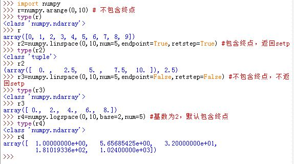 

### 2. 打印 ndarray 

当打印`ndarray`时，`numpy`按照Python的嵌套`list`的格式打印输出，但是按照以下顺序打印：

- 最底层的`axis`按照从左到右的顺序输出
- 次底层的`axis`按照从上到下的顺序输出
- 其他层的`axis`也是按照从上到下的顺序输出，但是每个`slice`中间间隔一条空行

如： 一维的`ndarray`按行打印；二维的`ndarray`按照矩阵打印；三维的`ndarray`按照矩阵的`list`打印

如果`ndarray`太大，那么`numpy`默认跳过中间部分的数据而只是输出四个角落的数据。
>要想任何时候都打印全部数据，可以在`print(array)`之前设置选项`numpy.set_printoptions(threshold='nan')`。这样后续的打印`ndarray`就不会省略中间数据。

### 3.  ndarray 算术运算和比较运算

`ndarray`的算术运算、比较操作都是元素级的操作并且产生一个`ndarray`对象作为结果。`ndarray`的算术运算符`+, -, *, /, //, %, divmod(), ** or pow(), <<, >>, &, ^, |, ~`以及比较运算符`==, <, >, <=, >=, !=`等价于相应的`numpy`中的`universal function`。 

注意：
- 如果两个`ndarray`的元素类型不相同，则四则运算结果的类型由精度最高的那个`ndarray`决定。
- `ndarray`支持原地算术操作，如`+=`、`*=`等，他会原地修改已存在的数组而不是创建一个新的数组。
- `ndarry`的矩阵`*`运算执行的是元素级相乘，而不是数学上的矩阵乘法。如果你想执行矩阵乘法，
  可以使用`numpy.dot(array1,array2)`实现两个`ndarray`的矩阵乘法。你也可以通过`array1.dot(array2)`
  实现同样的效果

   

  

### 4. 归一化操作

`ndarray`支持若干归一化方法：

- `ndarray.sum()`：累加`ndarray`所有元素的，并返回最终的和
- `ndarray.min()`：返回所有元素的最小值
- `ndarray.max()`：返回所有元素的最大值
- `ndarray.cumsum()`：返回所有元素的累加和，返回累加和序列

对于这些方法你如果想在指定`axis`上操作，则可以提供`axis`关键字参数，其参数值从（0到`ndim`）。默认情况下`axis=None`，表示将`ndarray`看作是一个一维的`ndarray`来操作。

   

  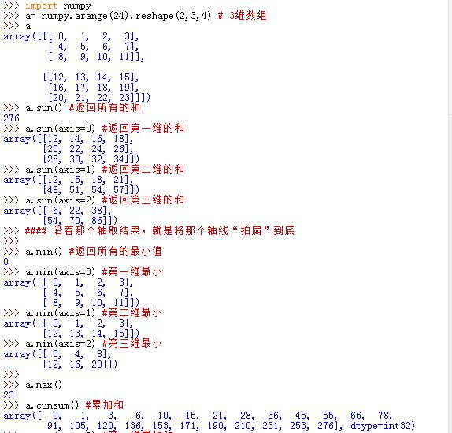 

### 5. 通用函数

`numpy`提供常见的数学函数如`sin`、`cos`、`exp`等，这些函数作用于`ndarray`的每一个元素，因此称为通用函数(`ufunc`)。所有的函数参考 https://docs.scipy.org/doc/numpy/reference/routines.html。

  

### 6. 索引、切片、迭代

- 一维数组可以被索引、切片、迭代，就像Python 列表一样操作
- 多维数组可以每个轴一个索引。这些索引由一个逗号分割的元组给出。
	- 当提供少于轴数的索引时，缺失的索引被认为是整个切片（必须提供前面的索引，可以缺失末尾的索引），如二维数组的`a[1]`
	- 如果想让缺失索引发生在前面，必须用`...`表示缺失索引。如二维数组的`a[...,1]`；而`a[1,...]`等价于`a[1]`
	- 你也可以显式的用`:`指定整个切片
- 多维数组的迭代仅仅只是迭代第一个轴。如果想迭代多维数组的每一个元素，可以用`ndarray.flat`属性，它是一个迭代器对象，迭代结果为`ndarray`的所有元素

  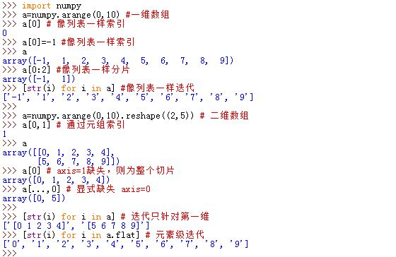

### 7. ndarray 的变形

`ndarray`的形状由`ndarray.shape`属性给出，它是一个元组，指出每个轴上的元素个数。你可以通过以下函数改变一个`ndarray`的形状：

- `numpy.ravel(a,order='C')`：将`a`展平，返回一个连续的一维`ndarray`。`a`是一个`array-like`对象，它的读取顺序为`order`（默认为C风格表示行优先读取）。
	- 如果`a`为`ndarray`，则可以用`ndarray.ravel(...)`方法，它等价于本函数
- `numpy.resize(a,new_shape)`：返回一个新`ndarray`，它是`a`满足`new_shape`的部分。其中`a`为一个`array-like`对象，而`new_shape`为新数组的形状。如果`new_shape`大于`a`的形状，则新`ndarray`复制`a`来填充新的部分。
	> 所谓的复制就是：首先展开，然后循环复制，然后变形
- `numpy.reshape(a,newshape,order='C')`:返回`a`的形状改变后的新`ndarray`。`a`为一个`array-like`对象。`newshape`必须与旧形状兼容（满足元素数量前后相同）。`a`的读取顺序为`order`（默认为C风格表示行优先读取）。
	- 如果`a`为`ndarray`，则可以用`ndarray.reshape(..)`方法，它等价于本函数
	>如果想改变`a`的形状，则直接修改`a.shape`属性即可

  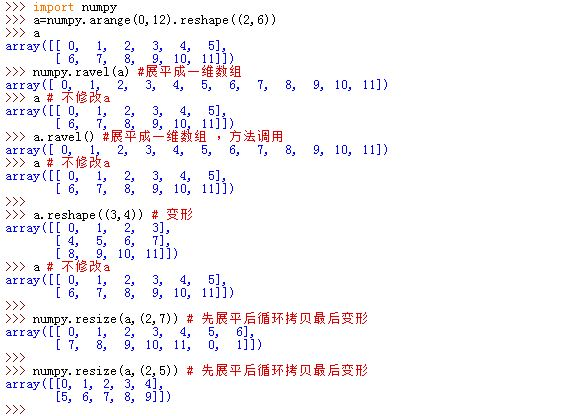

### 8. ndarray 的拼接

有几种办法将`ndarray`拼接起来：

-  `numpy.hstack(seq)`：水平拼接（即其他维度不变，维度1拼接），返回新创建的拼接后的`ndarray`。`seq`是一个序列，每个元素为一个`array-like`对象或者`ndarray`，且要求每个元素满足形状条件：除了维度1长度，其他维度长度必须相同。
-  `numpy.vstack(seq)`：垂直拼接（即其他维度不变，维度0拼接），返回新创建的拼接后的`ndarray`。`seq`是一个序列，每个元素为一个`array-like`对象或者`ndarray`，且要求每个元素满足形状条件：除了维度0长度，其他维度长度必须相同。
- `numpy.column_stack(seq)`：将一维数组按列拼接成二维数组，返回新创建的拼接后的`ndarray`。`seq`是一个序列，每个元素为一个`array-like`对象或者`ndarray`，且要求是一维的。拼接规则为：第一维长度为原数组长度，第二维长度为2，结果数组第二维每个元素为原来的数组序列中各取一个值的组成的数组。
- `numpy.concatenate((a1, a2, ...), axis=0)`：将一系列数组按照指定轴线拼接，返回新创建的拼接后的`ndarray`。`a1、a2、....`都是`array_like`对象，且要求每个元素满足形状条件：除了维度`axis`长度，其他维度长度必须相同。`axis`为拼接轴，默认为0（以哪个轴为拼接轴，就变化该轴的长度）
- `numpy.c_[a1,a2,...]`：沿着第二个轴拼接

  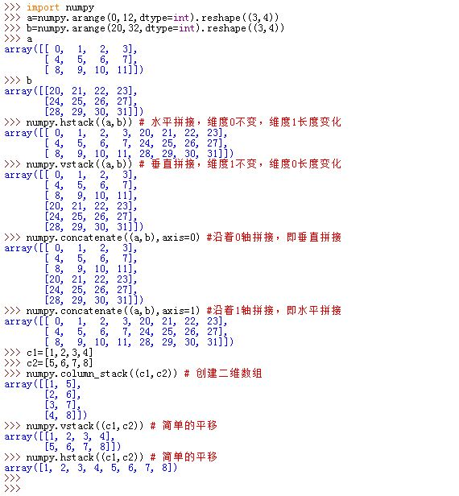
  

### 9.  ndarray 的拆分

有几种办法将`ndarray`拆分：

- `numpy.hsplit(array, indices_or_sections)`：将`array`按照水平拆分（沿着1轴），返回一个`ndarray`的列表。`array`为一个`ndarray`对象。	
- `numpy.vsplit(array, indices_or_sections)`：将`array`按照垂直拆分（沿着0轴），返回一个`ndarray`的列表。`array`为一个`ndarray`对象。`indices_or_sections`：
- `numpy.array_split(array, indices_or_sections,axis=0)`：将`array`按照指定轴线`axis`拆分，返回一个`ndarray`的列表。`array`为一个`ndarray`对象。`indices_or_sections`：

其共同的参数`indices_or_sections`：为一个整数标量或者一个一维数组。

- 如果是个整数`N`，则表示`array`沿着均匀拆分轴拆成`N`份。如果不能均匀拆分，则抛出异常
- 如果是个一维数组，则指示了拆分点。如`indices_or_sections`为`[2,3]`，则表示拆分段为
  `[0：2]`、`[2:3]`、`[3:]`。如果该一维数组中拆分点超过了轴线长度，则返回空的数组

  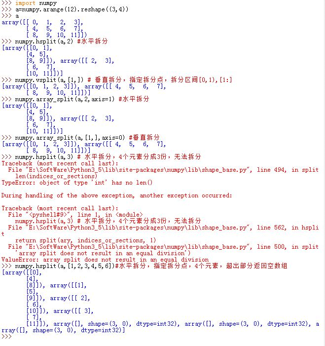

### 10. ndarray 的拷贝和视图

当处理`ndarray`时，它的基础数据有时被拷贝，但有时并不被拷贝。有三种情况。

#### a. 完全不拷贝

简单的赋值操作并不拷贝`ndarray`的数据，这种情况下是新的变量引用`ndarray`对象（类似于列表的简单赋值）

  

#### b. 视图和浅拷贝

不同的`ndarray`可能共享相同的基础数据。`ndarray.view()`方法创建一个新的`ndarray`但是与旧`ndarray`共享相同的数据（即新`ndarray`并不拥有数据）。

- 对于视图，`ndarray.base`返回的是视图的底层`ndarray`。而非视图`ndarray.base`返回`None`
- `ndarray.flags.owndata`返回`ndarray`是否拥有基础数据

对于`ndarray`的分片操作，它返回的是一个`ndarray`的视图。对`ndarray`的索引返回的不是视图，而是含有基础数据。

  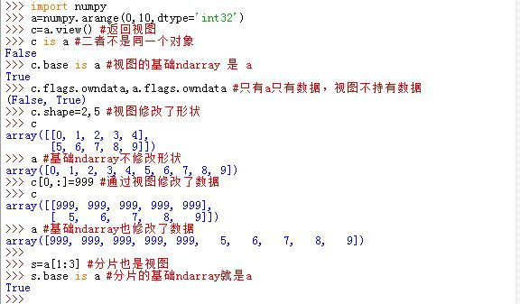

#### c. 深拷贝

`ndarray.copy()`操作会返回一个完全的拷贝，不仅拷贝`ndarray`也拷贝基础数据。

  

### 11. 广播法则

当通用函数处理多个不同形状的`ndarray`时，需要使用广播法则来处理。使用广播法则的前提条件：两个`ndarray`的对应维度的长度，要么相等；如果不等则必须有一个长度为1。不满足条件则不能使用广播法则。广播法则的条款是：

- 如果所有的输入数组维度不是完全相同，则某种规则将会被重复地添加数据到维度较小的`ndarray`的数组上直到所有的`ndarray`拥有一样的维度。
- 添加规则：确定`ndarray`的维度为长度为1的轴的方向扩张，且扩张时填充的数据都相同，就是该轴的原始数据（因为该维度长度为1）

  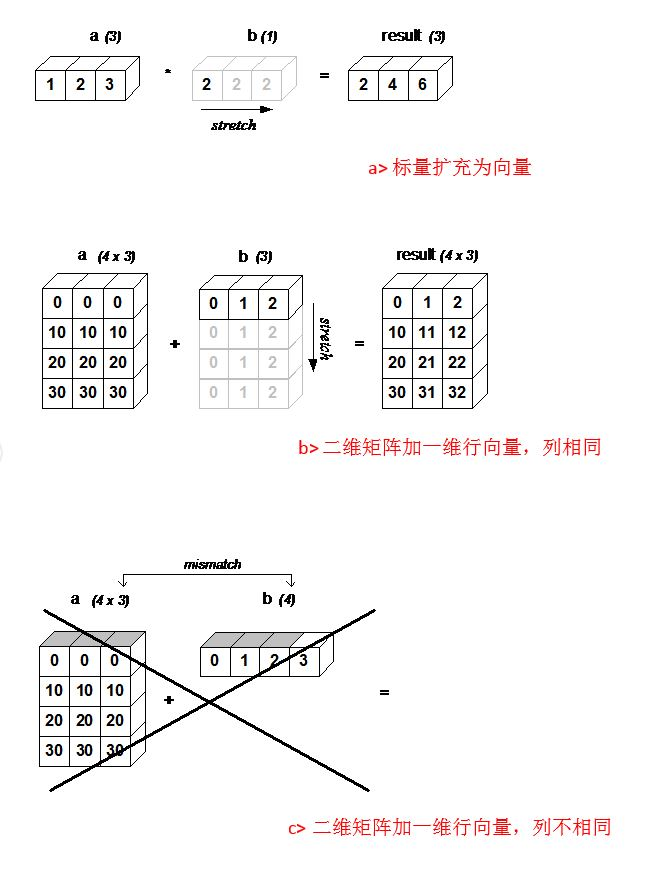
  

  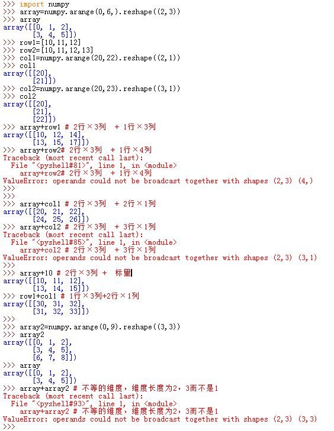

### 12. 索引技巧

除了利用Python中的索引和分片规则之外，`ndarray`还支持整数数组索引以及布尔数组索引。

#### a. 整数数组索引

索引数组每个整数是对`ndarray`的索引下标。其结果是一个`ndarray`的视图，外层维度由索引数组的维度，内层维度由`ndarray`的维度决定。

  

- 当被索引的`ndarray`是一个多维数组时，对它的索引是第0维的索引

  

- 当索引数组是一个多维数组时，每一维的索引数组必须有相同的形状
	- 这里你可以将索引数组放入序列中，如`a[[index1,index2]]`，它等价于`a[index1,index2]`。
		>注意这里的`index1、index2`均为索引数组。如果都是整数则`a[[inti,intj]]`（返回`ndarray`）
		  不等于`a[inti,intj]`（返回标量）。

  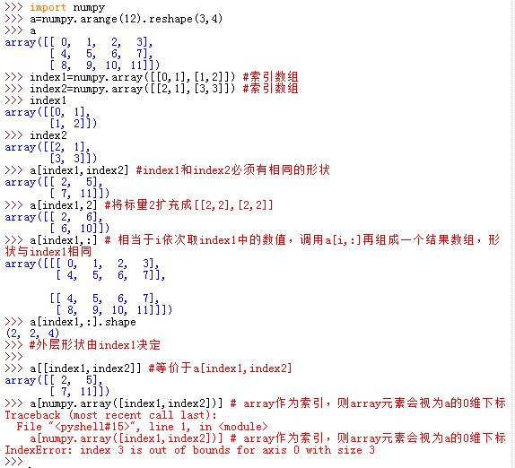

- 你可以使用数组索引作为目标来赋值。
	- 假设左侧被赋值的维度为m1×n1，则右侧赋值数据的维度可以为：m1×n1、m1×1、1×n1、1*1（标量）。
	  如果不满足则抛出异常。
	- 左侧的索引包含重复时，赋值被多次完成。保留最后的值。（要小心Python的+=结构）
	
  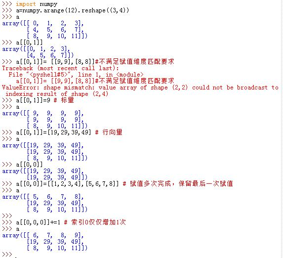

#### b. 通过布尔数组索引

通过布尔数组索引能够显式的选择数组中我们想要和不想要的元素。

- 最简单的方式就是使用和原数组一样形状的布尔数组
	> 常用于一次性修改原数组的不规则位置处的值

  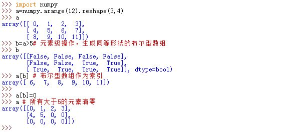

- 我们也可以采取类似整数切片的方式，对于原数组的每一个维度我们给以一维的布尔数组来选择我们需要的切片
	> 要求一维布尔数组的长度与你要切片的轴的长度一致

  

### 11.  ix_() 

`ix_()`函数能够排列组一组向量中的值，从而获取所有排列组合的结果。它接受`N`个一维数组，返回一个`N`元素的元组，其中元组的第`k`个元素都是一个这样的`N`维数组`ndarray`：该`ndarray`第`k`维长度等于参数列表第`k`个参数向量长度，第`k`维的值就是参数列表第`k`个参数向量的值，除了第`k`维之外所有其他维度的长度为1。
> 它的作用就是重排每一个向量，使得重排后每一个数组变成`N`维，然后这些数组依次占领第0维，第1维....第`N-1`维，从而使得广播法则能够起作用。

  

## 二、线性代数

### 1. 转置

`numpy.transpose(a,axes=None)`：获取`a`的转置（一个`array-like`对象）。其中`axes`是一个整数列表，指定交换轴。如果`axes`未指定，则默认翻转维度。

  

### 2. 逆矩阵

`numpy.linalg.inv(a)`：获取`a`的逆矩阵（一个`array-like`对象）。

- 如果传入的是多个矩阵，则依次计算这些矩阵的逆矩阵。
- 如果`a`不是方阵，或者`a`不可逆则抛出异常

  

### 3. 单位矩阵

`numpy.eye(N[, M, k, dtype])`：返回一个二维单位矩阵行为`N`，列为`M`，对角线元素为1，其余元素为0。`M`默认等于`N`。`k`默认为0表示对角线元素为1（单位矩阵），如为正数则表示对角线上方一格的元素为1（上单位矩阵），如为负数表示对角线下方一格的元素为1（下单位矩阵）

### 4. 点积

`numpy.dot(a, b, out=None)`：计算两个`array-like`对象的点乘。

- 如果是二维矩阵，则点乘就是代数上的矩阵乘法
- 如果是一维向量，则点乘就是向量的内积
- 如果是标量，则点乘就是普通乘法
- 如果是`N`维数组，则是`a`的最后一个轴与`b`的次最后轴之间的乘积和

  

### 5. 向量点积

`numpy.vdot(a, b)`：返回一维向量之间的点积。如果`a`和`b`是多维数组，则展平成一维再点积。

  

### 6. 向量外积

`numpy.outer(a, b, out=None)`：返回一维向量之间的外积。如果`a`和`b`是多维数组，则展平成一维再外积。
 假设`a = [a0, a1, ..., a_M]`，`b = [b0, b1, ..., b_N]`,则外积为:

```
 [
  [a0*b0  a0*b1 ... a0*b_N ]
  [a1*b0    .
  [ ...          .
  [a_M*b0            a_M*b_N ]
 ]
```

   

### 7. 叉乘

`numpy.cross(a, b, axisa=-1, axisb=-1, axisc=-1, axis=None)`:计算两个向量之间的叉乘。叉积用于判断两个三维空间的向量是否垂直。要求`a`和`b`都是二维向量或者三维向量，否则抛出异常。（当然他们也可以是二维向量的数组，或者三维向量的数组，此时一一叉乘）

  

### 8. 对角线和

`numpy.trace(a, offset=0, axis1=0, axis2=1, dtype=None, out=None)`：返回对角线的和。如果`a`是二维的，则直接选取对角线的元素之和（`offsert=0`），或者对角线右侧偏移`offset`的元素之和
> 即选取`a[i,i+offset]`之和

- 如果`a`不止二维，则由`axis1`和`axis2`指定的轴选取了取对角线的矩阵。
- 如果`a`少于二维，则抛出异常

  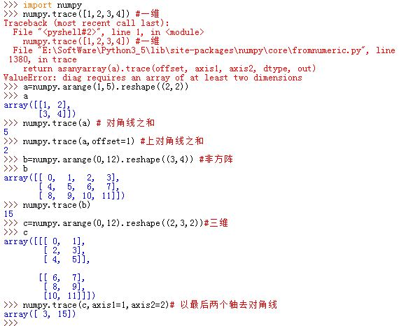

### 9. 计算线性方程的解`Ax=b`

`numpy.linalg.solve(a,b)`：计算线性方程的解`ax=b`，其中`a`为矩阵，要求为秩不为0的方阵，`b`为列向量（大小等于方阵大小）；或者`a`为标量，`b`也为标量。
> 如果`a`不是方阵或者`a`是方阵但是行列式为0，则抛出异常

  

### 10. 特征值

`numpy.linalg.eig(a)`：计算矩阵的特征值和右特征向量。如果不是方阵则抛出异常，如果行列式为0则抛出异常。

  

### 11. 奇异值分解

`numpy.linalg.svd(a, full_matrices=1, compute_uv=1)`:对矩阵`a`进行奇异值分解，将它分解成`u*np.diag(s)*v`的形式，其中`u`和`v`是酉矩阵，`s`是`a`的奇异值组成的一维数组。
其中：

- `full_matrics`:如果为`True`，则`u`形状为`(M,M)`，`v`形状为`(N,N)`；否则`u`形状为`(M,K)`，`v`形状为`(K,N)`，`K=min(M,N)`
- `compute_uv`：如果为`True`则表示要计算`u`和`v`。默认为`True`。
- 返回`u`、`s`、`v`的元组
- 如果不可分解则抛出异常

  

## 三、随机与分布函数

`numpy`中的随机和分布函数模块有两种用法：函数式以及类式

### 1. 函数式

#### a. 随机数

- `numpy.random.rand(d0, d1, ..., dn)`:指定形状`(d0, d1, ..., dn)`创建一个随机的`ndarray`。每个元素值来自于半闭半开区间`[0,1)`并且服从均匀分布。
	- 要求`d0, d1, ..., dn`为整数
	- 如果未提供参数，则返回一个随机的浮点数而不是`ndarray`，
	  浮点数值来自于半闭半开区间`[0,1)`并且服从均匀分布。
- `numpy.random.randn(d0, d1, ..., dn)`：指定形状`(d0, d1, ..., dn)`创建一个随机的`ndarray`。每个元素值服从正态分布，其中正态分布的期望为0，方差为1
	- 要求`d0, d1, ..., dn`为整数或者可以转换为整数
	- 如果`di`为浮点数，则截断成整数
	- 如果未提供参数，则返回一个随机的浮点数而不是`ndarray`，
	  浮点数值服从正态分布，其中正态分布的期望为0，方差为1
- `numpy.random.randint(low[, high, size])`：返回一个随机的整数`ndarray`或者一个随机的整数值。
	- 如果`high`为`None`，则表示整数值都取自`[0,low)`且服从`discrete uniform`分布
	- 如果`high`给出了值，则表示整数值都取自`[low,high)`且服从`discrete uniform`分布
	- `size`是一个整数的元组，指定了输出的`ndarray`的形状。如果为`None`则表示输出为单个整数值
- `numpy.random.random_integers(low[, high, size])`：返回一个随机的整数`ndarray`或者一个随机的整数值。
	- 如果`high`为`None`，则表示整数值都取自`[1,low]`且服从`discrete uniform`分布
	- 如果`high`给出了值，则表示整数值都取自`[low,high]`且服从`discrete uniform`分布
	- `size`是一个整数的元组，指定了输出的`ndarray`的形状。如果为`None`则表示输出为单个整数值	
	> 它与`randint`区别在于`randint`是半闭半开区间，而`random_integers`是全闭区间
- `numpy.random.random_sample([size])`：返回一个随机的浮点`ndarray`或者一个随机的浮点值，浮点值是`[0.0,1.0)`之间均匀分布的随机数
	- `size`为整数元组或者整数，指定结果`ndarray`的形状。如果为`None`则只输出单个浮点数
	-  如果想生成`[a,b)`之间均匀分布的浮点数，那么你可以用`(b-a)*random_sample()+a`
	> 如果`size`有效，它的效果等于`numpy.random.rand(*size)`；
	> 如果`size`无效，它的效果等于`numpy.random.rand()`

  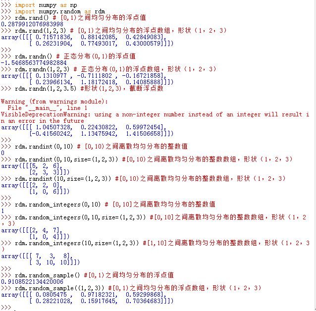

- `numpy.random.random([size])`：等价于`numpy.random.random_sample([size])`
- `numpy.random.ranf([size])`：等价于`numpy.random.random_sample([size])`
- `numpy.random.sample([size])`：等价于`numpy.random.random_sample([size])`

  

- `numpy.random.choice(a[, size, replace, p])`:从一维数组中采样产生一组随机数或者一个随机数
	- `a`为一位数组或者`int`，如果是`int`则采样数据由`numpy.arange(n)`提供，否则采用数据由`a`提供
	- `size`为整数元组或者整数，指定结果`ndarray`的形状。如果为`None`则只输单个值
	- `replace`：如果为`True`则采样不替换
	- `p`：为一维数组，用于指定采样数组中每个元素值的采样概率。如果为`None`则均匀采样。
	- 如果参数有问题则抛出异常：比如`a`为整数但是小于0，比如`p`不满足概率和为`1`，等等。。

  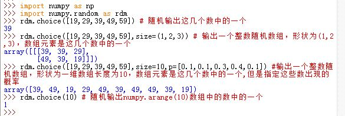

- `numpy.random.bytes(length)`：返回`length`长度的随机字节串。`length`指定字节长度。

  

#### b. 排列组合

- `numpy.random.shuffle(x)`:原地随机混洗`x`的内容，返回`None`。`x`为`array-like`对象，原地修改它
- `numpy.random.permutation(x)`：随机重排`x`，返回重排后的`ndarray`。`x`为`array-like`对象，不会修改它
	- 如果`x`是个整数，则重排`numpy.arange(x)`
	- 如果`x`是个数组，则拷贝它然后对拷贝进行混洗
		- 如果`x`是个多维数则只是混洗它的第0维

  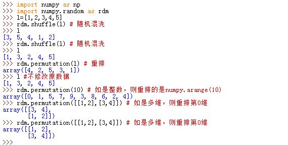

#### c. 概率分布函数

下面是共同参数：`size`若非`None`，则它指定输出`ndarray`的形状。如果为`None`，则输出单个值。

- `numpy.random.beta(a, b[, size])`：Beta分布。其中`a,b`都是Beta分布的参数，要求非负浮点数。
	- 贝塔分布为：
\\(f(x;\alpha,\beta)=\frac {1}{B(\alpha,\beta)} x^{\alpha-1}(1-x)^{\beta-1} \\)，其中：
  \\( B(\alpha,\beta)=\int_0^{1} t^{\alpha-1}(1-t)^{\beta-1}\,dt \\)

- `numpy.random.binomial(n, p[, size])`:二项分布。其中`n,p`都是二项分布的参数，要求`n`为大于等于0的浮点数，如果它为浮点数则截断为整数；`p`为`[0,1]`之间的浮点数。
	- 二项分布为：\\( P(N)=\binom{n}{N}p^{N}(1-p)^{n-N}\\)

- `numpy.random.chisquare(df[, size])`:卡方分布。其中`df`为整数，是卡方分布的自由度（若小于等于0则抛出异常）。
	- 卡方分布为： \\( p(x)=\frac{(1/2)^{k/2}}{\Gamma(k/2)} x^{k/2-1}e^{-x/2}\\)，其中
	\\( \Gamma(x)=\int^{\infty}_0 t^{x-1}e^{-t}\,dt\\)

- `numpy.random.dirichlet(alpha[, size])`:狄利克雷分布。其中`alpha`是个数组，为狄利克雷分布的参数。

- `numpy.random.exponential([scale, size])`:指数分布。`scale`为浮点数，是参数 \\( \beta \\)
	- 指数分布的概率密度函数为:\\( f(x;\frac {1}{\beta})=\frac{1}{\beta}\exp(-\frac{x}{\beta})\\)

- `numpy.random.f(dfnum, dfden[, size]) `:`F`分布。`dfnum`为浮点数，应该大于0，是分子的自由度；
  `dfden`是浮点数，应该大于0，是分母的自由度。

- `numpy.random.gamma(shape[, scale, size])`:伽玛分布。其中`shape`是个大于0的标量，表示分布的形状；`scale`是个大于0的标量，表示伽玛分布的`scale`（默认为1）。
	- 伽玛分布的概率密度函数为:\\(p(x)=x^{k-1} \frac {e^{-x/\theta}}{\theta^{k}\Gamma(k)}\\)，其中`k`为形状， \\(\theta\\) 为`scale`

- `numpy.random.geometric(p[, size])`:几何分布。其中`p`是单次试验成功的概率。
	- 几何分布为：\\(f(k)=(1-p)^{k-1}p\\)

- `numpy.random.gumbel([loc, scale, size])`:甘贝尔分布。其中`loc`为浮点数，是分布的`location of mode`，`scale`是浮点数，为`scale`。
	- 甘贝尔分布:\\( p(x)=\frac {e^{-(x-\mu)/\beta}}{\beta}  e^{-e-(x-\mu)/\beta}\\)，其中 \\( \mu\\) 为`location of mode`， \\(\beta \\) 为`scale`

- `numpy.random.hypergeometric(ngood, nbad, nsample[, size]) `: 超几何分布。其中`ngood`为整数或者`array_like`，必须非负数，为好的选择；`nbad`为整数或者`array_like`，必须非负数，表示坏的选择。
	- 超级几何分布：\\( P(x)= \frac {\binom{m}{n} \binom{N-m}{n-x}} {\binom{N}{n}}, 0 \le x \le m \ \text{and} \ n+m-N \le x \le n \\)，其中`n=ngood`，`m=nbad`，`N`为样本数量。`P(x)`为`x`成功的概率

- `numpy.random.laplace([loc, scale, size]) `:拉普拉斯分布。`loc`为浮点数，`scale`为浮点数
	- 拉普拉斯分布：\\(f(x;\mu,\lambda)=\frac {1}{2\lambda} \exp(- \frac{\|x-\mu\|}{\lambda}) \\)，其中 `loc`=\\(\mu \\) ， `scale`=\\( \lambda \\)

- `numpy.random.logistic([loc, scale, size])`:逻辑斯谛分布。其中`loc`为浮点数，`scale`为大于0的浮点数
	- 逻辑斯谛分布： \\(P(x)= \frac {e^{-(x-\mu)/s}}{s(1+e^{-(x-\mu)/s})^{2}}\\)， 其中 `loc`=\\( \mu \\),  `scale`= \\( s\\)

- `numpy.random.lognormal([mean, sigma, size])`:对数正态分布。其中`mean`为浮点数，`sigma`为大于0的浮点数。
	- 对数正态分布：\\( p(x)=\frac {1}{\sigma x \sqrt{2\pi}} e^{-(\ln(x)-\mu)^{2}/(2\sigma^{2})}\\)，其中`mean`=\\(\mu\\) ， `sigma`= \\( \sigma\\)

- `numpy.random.logseries(p[, size])`:对数分布，其中`p`为`[0.0--1.0]`之间的浮点数。
	- 对数分布：\\(P(k)=\frac {-p^{k}}{k\ln(1-p)} \\)

- `numpy.random.multinomial(n, pvals[, size])`:多项式分布。`n`为执行二项分布的试验次数，`pvals`为浮点序列，要求这些序列的和为1，其长度为`n`。

- `numpy.random.multivariate_normal(mean, cov[, size]) `:多元正态分布。`mean`为一维数组，长度为`N`；`cov`为二维数组，形状为`(N,N)`

- `numpy.random.negative_binomial(n, p[, size]) `:负二项分布。`n`为整数，大于0；`p`为`[0.0--1.0]`之间的浮点数。
	- 负二项分布：\\( P(N;n,p)=\binom{N+n-1}{n-1}p^{n}(1-p)^{N} \\)

- `numpy.random.noncentral_chisquare(df, nonc[, size]) `:非中心卡方分布。`df`为整数，必须大于0;`noc`为大于0的浮点数。
	-  非中心卡方分布： \\( P(x;k,\lambda)= \sum_{i=0}^{\infty } f_Y(x) \frac  {e^{-\lambda/2}(-\lambda/2)^{i}}{i!} \\) 
 
	其中 \\( Y=Y_{k+2i} \\)为卡方分布，	`df`为`k`，`nonc`为 \\( \lambda\\)

- `numpy.random.noncentral_f(dfnum, dfden, nonc[, size]) `:非中心`F`分布。其中`dfnum`为大于1的整数，`dfden`为大于1的整数，`nonc`为大于等于0的浮点数。

- `numpy.random.normal([loc, scale, size]) `:正态分布。其中`loc`为浮点数，`scale`为浮点数。
	- 正态分布： \\(p(x)=\frac {1}{\sqrt{2\pi\sigma^{2}}}e^{-(x-\mu)^{2}/(2\sigma^{2})} \\)，其中`loc`=\\( \mu \\)， `scale`=\\( \sigma \\)

- `numpy.random.pareto(a[, size]) `:帕累托分布。其中`a`为浮点数。
	- 帕累托分布： \\( p(x)= \frac {\alpha m ^{\alpha}}{x^{\alpha+1}}\\)，其中`a`=\\( \alpha \\), `m`为`scale`

- `numpy.random.poisson([lam, size]) `:泊松分布。其中`lam`为浮点数或者一个浮点序列（浮点数大于等于0）。
	- 泊松分布： \\( f(k;\lambda)=\frac {\lambda^{k}e^{-\lambda}}{k!}\\)，其中`lam`=\\(\lambda\\)

- `numpy.random.power(a[, size]) `:幂级数分布。其中`a`为大于0的浮点数。
	- 幂级数分布： \\( P(x;a)=ax^{a-1},0\le x \le 1,a \gt 0 \\)

- `numpy.random.rayleigh([scale, size])`: 瑞利分布。其中`scale`为大于0的浮点数。
	- 瑞利分布：\\( P(x;\sigma)=\frac{x}{\sigma^{2}}e^{-x^{2}/(2\sigma^{2})}\\)，其中`scale`=\\( \sigma \\)

- `numpy.random.standard_cauchy([size]) `:标准柯西分布。
	- 柯西分布：\\( P(x;x_0,\gamma)=\frac{1}{\pi\gamma[1+((x-x_0)/\gamma)^{2}]}\\)，其中标准柯西分布中， \\( x_0=1,\gamma=1\\)

- `numpy.random.standard_exponential([size]) `:标准指数分布。其中`scale`等于1
- `numpy.random.standard_gamma(shape[, size]) `:标准伽玛分布，其中`scale`等于1
- `numpy.random.standard_normal([size]) `:标准正态分布，其中`mean`=0，`stdev`等于1

- `numpy.random.standard_t(df[, size])`:学生分布。其中`df`是大于0的整数。
	- 学生分布: \\( f(t;\nu)=\frac{\Gamma((\nu+1)/2)}{\sqrt{\nu\pi}\Gamma(\nu/2)}(1+t^{2}/\nu)^{-(\nu+1)/2}\\)， 其中 `df`= \\( \nu \\)

- `numpy.random.triangular(left, mode, right[, size]) `: 三角分布。其中`left`为标量，`mode`为标量，`right`为标量
	- 三角分布（其中`left`=`l`，`mode`=`m`，`right`=`r`）：

$$ P(x;l,m,r)= \left\\{
\begin{matrix}
\frac{2(x-l)}{(r-l)(m-l)}, & \text{for $l \le x \le m$} \\\
\frac{2(r-x)}{(r-l)(r-m)}, & \text{for $m \le x \le r$} \\\
0, & \text{otherwise}
\end{matrix}
\right.$$

- `numpy.random.uniform([low, high, size]) `:均匀分布。其中`low`为浮点数；`high`为浮点数。
	- 均匀分布：\\(  p(x)=\frac {1}{b-a}\\)，其中`low`=`a`, `high`=`b`

- `numpy.random.vonmises(mu, kappa[, size]) `:`Mises`分布。其中`mu`为浮点数，`kappa`为大于等于0的浮点数。
	- `Mises`分布：\\(p(x)= \frac{e^{\kappa \cos(x-\mu)}}{2\pi I_0(\kappa)} \\)，其中`mu`=\\( \mu \\)， `kappa`=\\( \kappa \\)， \\(I_0(\kappa) \\)是 `modified Bessel function of order 0`

- `numpy.random.wald(mean, scale[, size]) `:`Wald`分布。其中`mean`为大于0的标量，`scale`为大于等于0的标量
	- `Wald`分布：\\( P(x;\mu,\lambda)=\sqrt{\frac {\lambda}{2\pi x^{3}}} \exp \\{\frac{-\lambda(x-\mu)^{2}}{2\mu^{2}x}\\}\\)，其中`mean`=\\( \mu \\)， `scale`=\\(\lambda \\)

- `numpy.random.weibull(a[, size])`： `Weibull`分布。其中`a`是个浮点数。
	- `Weibull`分布: \\( p(x)= \frac {a}{\lambda} (\frac {x}{\lambda})^{a-1} e^{-(x/\lambda)^{a}}\\)，其中`a`=\\( a \\)，\\( lambda \\) 为`scale`

- `numpy.random.zipf(a[, size])`:齐夫分布。其中`a`为大于1的浮点数。
	- 齐夫分布： \\( p(x)=\frac {x^{-a}}{\zeta(a)}\\) ，其中 `a`=\\(a \\)， \\( \zeta \\) 为 ` Riemann Zeta `函数。

### 2. RandomState类

类式用法主要使用`numpy.random.RandomState`类，它是一个`Mersenne Twister`伪随机数生成器的容器。它提供了一些方法来生成各种各样概率分布的随机数。

构造函数:`RandomState(seed)`。其中`seed`可以为`None`, `int`, `array_like`。这个`seed`是初始化伪随机数生成器。如果`seed`为`None`，则`RandomState`会尝试读取`/dev/urandom`或者`Windows analogure`来读取数据，或用者`clock`来做种子。

> `Python`的`stdlib`模块`random`也提供了一个` Mersenne Twister`伪随机数生成器。但是`RandomState`提供了更多的概率分布函数。

`RandomState`保证了通过使用同一个`seed`以及同样参数的方法序列调用会产生同样的随机数序列（除了浮点数精度上的区别）。

`RandomState`提供了一些方法来产生各种分布的随机数。这些方法都有一个共同的参数`size`。

- 如果`size`为`None`，则只产生一个随机数
- 如果`size`为一个整数，则产生一个一维的随机数数组。
- 如果`size`为一个元组，则生成一个多维的随机数数组。其中数组的形状由元组指定。

#### a. 生成随机数的方法

- `.bytes(length)`：等效于`numpy.random.bytes(...)`函数
- `.choice(a[, size, replace, p])`：等效于`numpy.random.choice(...)`函数
- `.rand(d0, d1, ..., dn)`：等效于`numpy.random.rand(...)`函数
- `.randint(low[, high, size])`：等效于`numpy.random.randint(...)`函数
- `.randn(d0, d1, ..., dn)` ：等效于`numpy.random.randn(...)`函数
- `.random_integers(low[, high, size])`：等效于`numpy.random_integers.bytes(...)`函数
- `.random_sample([size]) `：等效于`numpy.random.random_sample(...)`函数
- `.tomaxint([size])`：等效于`numpy.random.tomaxint(...)`函数

#### b. 排列组合的方法

- `.shuffle(x)`：等效于`numpy.random.shuffle(...)`函数
- `.permutation(x)` ：等效于`numpy.random.permutation(...)`函数

#### c. 指定概率分布函数的方法

- `.beta(a, b[, size])`：等效于`numpy.random.beta(...)`函数
- `.binomial(n, p[, size])`：等效于`numpy.random.binomial(...)`函数
- `.chisquare(df[, size])`：等效于`numpy.random.chisquare(...)`函数
- `.dirichlet(alpha[, size])`：等效于`numpy.random.dirichlet(...)`函数
- `.exponential([scale, size])`：等效于`numpy.random.exponential(...)`函数
- `.f(dfnum, dfden[, size])`：等效于`numpy.random.f(...)`函数
- `.gamma(shape[, scale, size])`：等效于`numpy.random.gamma(...)`函数
- `.geometric(p[, size])`：等效于`numpy.random.geometric(...)`函数
- `.gumbel([loc, scale, size])`：等效于`numpy.random.gumbel(...)`函数
- `.hypergeometric(ngood, nbad, nsample[, size])`：等效于`numpy.random.hypergeometric(...)`函数
- `.laplace([loc, scale, size])`：等效于`numpy.random.laplace(...)`函数
- `.logistic([loc, scale, size])`：等效于`numpy.random.logistic(...)`函数
- `.lognormal([mean, sigma, size]) `：等效于`numpy.random.lognormal(...)`函数
- `.logseries(p[, size])`：等效于`numpy.random.logseries(...)`函数
- `.multinomial(n, pvals[, size])`：等效于`numpy.random.multinomial(...)`函数
- `.multivariate_normal(mean, cov[, size])`：等效于`numpy.random.multivariate_normal(...)`函数
- `.negative_binomial(n, p[, size])`：等效于`numpy.random.negative_binomial(...)`函数
- `.noncentral_chisquare(df, nonc[, size])`：等效于`numpy.random.noncentral_chisquare(...)`函数
- `.noncentral_f(dfnum, dfden, nonc[, size])`：等效于`numpy.random.noncentral_f(...)`函数
- `.normal([loc, scale, size])`：等效于`numpy.random.normal(...)`函数
- `.pareto(a[, size])`：等效于`numpy.random.pareto(...)`函数
-`. poisson([lam, size])`：等效于`numpy.random.poisson(...)`函数
- `.power(a[, size])`：等效于`numpy.random.power(...)`函数
- `.rayleigh([scale, size])`：等效于`numpy.random.rayleigh(...)`函数
- `.standard_cauchy([size])`：等效于`numpy.random.standard_cauchy(...)`函数
- `.standard_exponential([size])`：等效于`numpy.random.standard_exponential(...)`函数
- `.standard_gamma(shape[, size])`：等效于`numpy.random.standard_gamma(...)`函数
- `.standard_normal([size])`：等效于`numpy.random.standard_normal(...)`函数
- `.standard_t(df[, size])`：等效于`numpy.random.standard_t(...)`函数
- `.triangular(left, mode, right[, size]) `：等效于`numpy.random.triangular(...)`函数
- `.uniform([low, high, size])`：等效于`numpy.random.uniform(...)`函数
- `.vonmises(mu, kappa[, size])`：等效于`numpy.random.vonmises(...)`函数
- `.wald(mean, scale[, size])`：等效于`numpy.random.wald(...)`函数
- `.weibull(a[, size])`：等效于`numpy.random.weibull(...)`函数
- `.zipf(a[, size])`：等效于`numpy.random.zipf(...)`函数

#### d. 类式的其他函数

- `seed(seed=None)`：该方法在`RandomState`被初始化时自动调用，你也可以反复调用它从而重新设置伪随机数生成器的种子。

-  `get_state()`：该方法返回伪随机数生成器的内部状态。其结果是一个元组`(str, ndarray of 624 uints, int, int, float)`，依次为：
	- 字符串`'MT19937'`
	- 一维数组，其中是624个无符号整数`key`
	- 一个整数`pos`
	- 一个整数`has_gauss`
	- 一个浮点数`cached_gaussian`
- `set_state(state)`：该方法设置伪随机数生成器的内部状态,如果执行成功则返回`None。参数是个元组`(str, ndarray of 624 uints, int, int, float)`，依次为：
	- 字符串`'MT19937'`
	- 一维数组，其中是624个无符号整数`key`
	- 一个整数`pos`
	- 一个整数`has_gauss`
	- 一个浮点数`cached_gaussian`

## 四、统计函数

### 1. 顺序统计

- `numpy.amin(a[, axis, out, keepdims])` ：返回`a`中指定轴线上的最小值（数组）、或者返回`a`上的最小值（标量）。
- `numpy.amax(a[, axis, out, keepdims])` ：返回`a`中指定轴线上的最大值（数组）、或者返回`a`上的最小值（标量）。
- `numpy.nanmin(a[, axis, out, keepdims])`: 返回`a`中指定轴线上的最小值（数组）、或者返回`a`上的最小值（标量），忽略`NaN`。
- `numpy.nanmax(a[, axis, out, keepdims])` :返回`a`中指定轴线上的最大值（数组）、或者返回`a`上的最小值（标量）忽略`NaN`。
- `numpy.ptp(a[, axis, out])` ：返回`a`中指定轴线上的`maximum减去minimum`（数组），即`peak to peak`
- `numpy.percentile(a, q[, axis, out, ...])` ：返回`a`中指定轴线上`qth 百分比`数据
- `numpy.nanpercentile(a, q[, axis, out, ...])`：返回`a`中指定轴线上`qth 百分比`数据

这里是共同的参数：

- `a`：一个`array_like`对象
- `axis`：可以为为`int`或者`tuple`或者`None`：
	- `None`：将`a`展平，在整个数组上操作
	- `int`：在`a`的指定轴线上操作
	- `tuple of ints`：在`a`的一组指定轴线上操作
- `out`：可选的输出位置。必须与期望的结果形状相同
- `keepdims`：如果为`True`，则被操作的轴线上的数据会保留在结果中。

### 2. 均值和方差

- `numpy.median(a[, axis, out, overwrite_input, keepdims])`:计算`a`在指定轴上的中位数
- `numpy.average(a[, axis, weights, returned])`:计算`a`在指定轴上的加权平均数
- `numpy.mean(a[, axis, dtype, out, keepdims])` :计算`a`在指定轴上的算术均值
- `numpy.std(a[, axis, dtype, out, ddof, keepdims])`:计算`a`在指定轴上的标准差
- `numpy.var(a[, axis, dtype, out, ddof, keepdims])` :计算`a`在指定轴上的方差
- `numpy.nanmedian(a[, axis, out, overwrite_input, ...])` :计算`a`在指定轴上的中位数，忽略`NaN`
- `numpy.nanmean(a[, axis, dtype, out, keepdims])`  :计算`a`在指定轴上的算术均值，忽略`NaN`
- `numpy.nanstd(a[, axis, dtype, out, ddof, keepdims])`:计算`a`在指定轴上的标准差，忽略`NaN`
- `numpy.nanvar(a[, axis, dtype, out, ddof, keepdims])` :计算`a`在指定轴上的方差，忽略`NaN`

这里是共同的参数：

- `a`：一个`array_like`对象
- `axis`：可以为为`int`或者`tuple`或者`None`：
	- `None`：将`a`展平，在整个数组上操作
	- `int`：在`a`的指定轴线上操作
	- `tuple of ints`：在`a`的一组指定轴线上操作
- `out`：可选的输出位置。必须与期望的结果形状相同

### 3. 相关系数

- `numpy.corrcoef(x[, y, rowvar, bias, ddof])` : 返回皮尔逊积差相关
- `numpy.correlate(a, v[, mode])` ：返回两个一维数组的互相关系数
- `numpy.cov(m[, y, rowvar, bias, ddof, fweights, ...])`：返回协方差矩阵

### 4. 直方图

- `numpy.histogram(a[, bins, range, normed, weights, ...])`:计算一组数据的直方图
- `numpy.histogram2d(x, y[, bins, range, normed, weights])` ：计算两组数据的二维直方图
- `numpy.histogramdd(sample[, bins, range, normed, ...])` ：计算多维数据的直方图
- `numpy.bincount(x[, weights, minlength])`：计算每个数出现的次数
- `numpy.digitize(x, bins[, right])` ：返回每个数属于哪个`bin`

## 五、技巧

### 1. 自动形状推断

当你修改`ndarray`的形状时，你可以省略某个维度的尺寸（设置为`-1`，该维度尺寸会自动推断出来。如：
`a.shape=2,-1,3 # -1 表示能够自动推断出来`

### 2.  histogram  

`numpy.histogram(a, bins=10, range=None, normed=False, weights=None, density=None)`函数应用到一个数组返回一对变量：

- 直方图数组：区间内统计的样本数量（也可能归一化为样本频率）
- 长条的底边划分序列：区间划分点（该划分点将`range`划分为若干个区间）

其个参数名字为：

- `a`：`array-like`对象，为输入数据。如果是多维数组则展平为一维
- `bins`：
	- 如果为整数，则它定义了在指定`range`内的等宽度长条的数量
	- 如果为整数序列，则它定义了长条的底边
	- 如果为字符串，则比较复杂，具体可参考文档
- `range`：所有等宽长条的下界和上界。如果未提供则结果是元组`(a.min(),a.max())`。如果`a`有元素值在它之外，则忽略该元素。
- `normed`：该关键字是`deprecated`。
- `weights`：权重数组。它是`a`形状相同，它给出了对应的`a`中的元素的权重。如果`desity`为`True`，则该数组被归一化。
- `density`:如果为`False`，则结果是每个长条的样本数量；如果为`True`则结果是每个长条的频率值（估计密度函数）。


> 注意：`matplotlib.pyplot`也有一个建立直方图的函数（`hist(...)`），区别在于`matplotlib.pyplot.hist(...)`函数会自动绘直方图，而`numpy.histogram`仅仅产生数据

  

  

### 3. NaN和无穷大

在`numpy`中，有几个特殊的数：

- `numpy.nan`表示`NaN`（`Not a Number`），它并不等价于`numpy.inf`（无穷大）。
- `numpy.inf`：正无穷
- `numpy.PINF`：正无穷（它就引用的是`numpy.inf`）
- `numpy.NINF`：负无穷

有下列函数用于判断这几个特殊的数：

- `numpy.isnan(x[,out])`：返回`x`是否是个`NaN`，其中`x`可以是标量，可以是数组
- `numpy.isfinite(x[, out])`：返回`x`是否是个有限大小的数，其中`x`可以是标量，可以是数组
	> `numpy.isfinite(np.nan)`返回`False`，因为`NaN`首先就不是一个数
- `numpy.isposinf(x[, out])`：返回`x`是否是个正无穷大的数，其中`x`可以是标量，可以是数组
	> `numpy.isposinf(np.nan)`返回`False`，因为`NaN`首先就不是一个数	
- `numpy.isneginf(x[, out])`：返回`x`是否是个负无穷大的数，其中`x`可以是标量，可以是数组
	> `numpy.isneginf(np.nan)`返回`False`，因为`NaN`首先就不是一个数
- `numpy.isinf(x[, out])`：返回`x`是否是个无穷大的数，其中`x`可以是标量，可以是数组
	> `numpy.isinf(np.nan)`返回`False`，因为`NaN`首先就不是一个数

下列函数用于对这几个特殊的数进行转换：

- `numpy.nan_to_num(x)`：将`x`中的下列数字替换掉，返回替换掉之后的新数组：
	- `NaN`：替换为0
	- 正无穷：替换为一个非常大的数字
	- 负无穷：替换为一个非常小的数字

### 4. meshgrid

`numpy.meshgrid(x,y)`:返回两个向量的网格。

- `x`和`y`均为一维的数组，代表网格的`x`轴和 `y`轴坐标
- 返回一个元组 `(X,Y)`，其中`X`是个数组，它是由`x`沿着第一维扩展成`(y.size,x.size)`大小的数组；`Y `也是个数字。它是`y `先转置，再沿着 第二维扩展成`(y.size,x.size)`大小的数组

  

### 5. 升维

在对数组切片时，可以插入 `None`或者`numpy.newaxis`来对切片之后的结果升维。它们被插入的位置就是被增加的维度：

  
 
### 6. 行向量、列向量

行向量的形状为`(1,n)`，列向量的形状为`(n,1)`。行向量与列向量可以通过转置操作完成相互转换。
> 注意：不是 `(n,)`

- 生成行向量的方法：
	- `np.c_[n_1,n_2]`：其中 `n1`，`n2`等等均为数字

- 生成列向量的方法：
	- `np.c_[n_1,n_2].T`：其中 `n1`，`n2`等等均为数字

  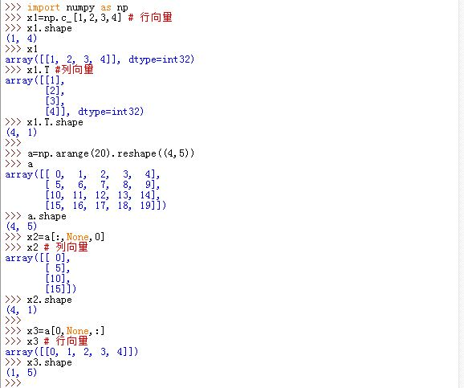
